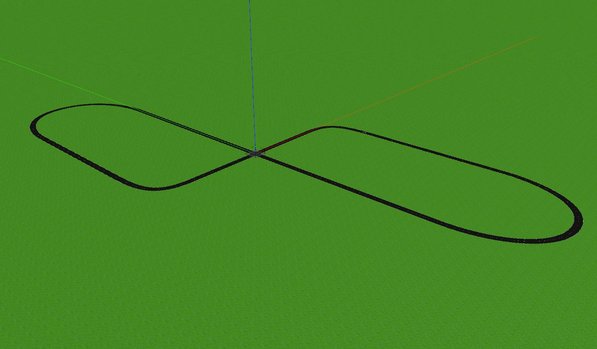

# ECE 6460 Final Project - Group 5

## Setup
- Clone this repository into your ROS workspace
- Clone `gazebo_traffic_light` into your ROS workspace: https://github.com/robustify/gazebo_traffic_light
- Compile ROS workspace
- Update course code software to version 1.0.6: `bash <(wget -O - "http://secs.oakland.edu/~mtradovn/ece_6460/software_update.bash")`
  - You can verify the version by checking `package.xml` of `avs_lecture_launch` and looking at the `<version>` tag:
```
roscd avs_lecture_launch
gedit package.xml
```

## Run Simulation
Start up the simulation using the `sim_launch.launch` file in this package. Review this launch file to see how the simulation is set up and how to modify it to run your node. You can change the behavior of the traffic lights by changing the `road_intersection_0/light_sequence` parameter. Right now, all four traffic lights will follow the same sequence, but luckily there won't be other cars in the world to crash with, haha.

## Traffic Light Positions
The pose of each of the traffic lights is represented in a different static TF transform from `world` frame to the name of the particular traffic light. In your code, you can use a TF listener to lookup the transform between the camera frame and the traffic light frames to figure out where the traffic lights are in the image. Keep in mind that the origin of the traffic light frames is positioned at the bottom of the light fixture.

## Gazebo World
The Gazebo world is a figure-8 with a 4-way intersection in the middle:

